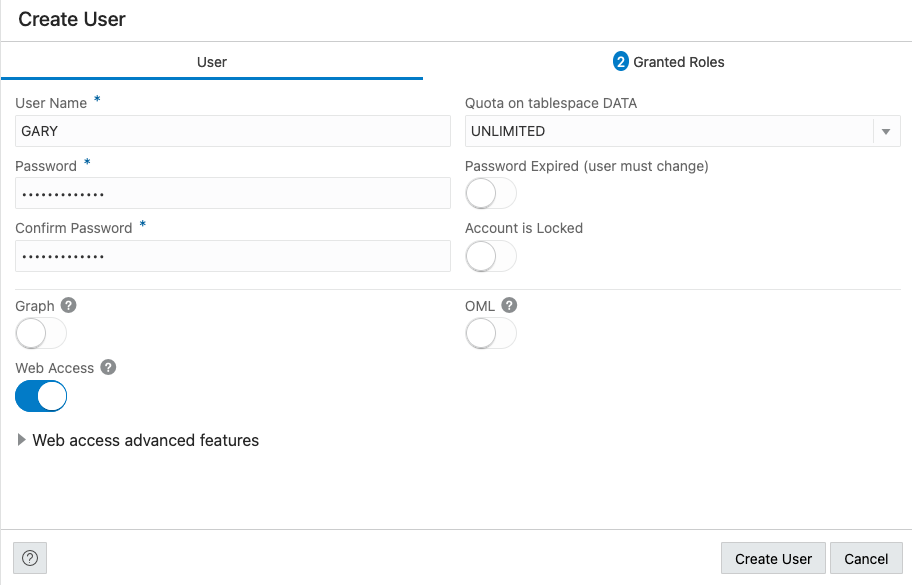
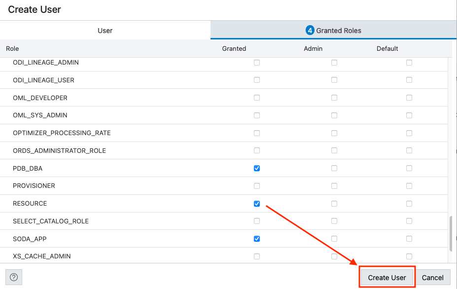
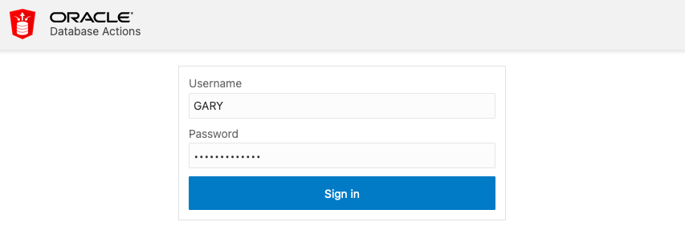

# Setups for the Choose your Own JSON Adventure: Relational or Document Store LiveLab

## Introduction

In this part of the lab, we will be rely on Database Actions to

- Create a user
- Grant the user a role and quota
- Log into Database Actions as the new user

Estimated Lab Time: 10 minutes

### Objectives

- Create a Database User
- Grant user needed roles, quota and REST access
- Access Database Actions as a new user

### Prerequisites

- The following lab requires an [Oracle Cloud account](https://www.oracle.com/cloud/free/). You may use your own cloud account, a cloud account that you obtained through a trial, or a training account whose details were given to you by an Oracle instructor.
- This lab assumes you have successfully provisioned an Oracle Autonomous database and have connected to it with Database Actions.

## Task 1: Create a user

1. First, we want to create a database schema for our tables, business logic and data. We do this by creating a database user. To create a database user, we start by clicking the Database Actions Menu in the upper left of the page, then clicking Database Users in the Administration List. It is not good practice to use a SYS or SYSTEM user to create an application's tables, and neither is it good practice to use the ADMIN account to create applications.

    

2. Now, click the Create User button on the left side of the page. This will slide out the Create User panel.

    

3. Start by entering a user name. Let's use GARY as the username. Next we need to enter a password. The password must be complex enough to pass the password profile set by the database.

   > 🚨 Passwords  must be 12 to 30 characters and contain at least one uppercase letter, one lowercase letter, and one number. The password cannot contain the double quote (") character or the username "admin".

   Once we enter the password twice, ensure the **Web Access** button is on. This will allow us to use REST services with this database schema from the start as well as use the Database Actions tools.

    In the right column of options, find the **Quota on tablespace DATA** dropdown select list. Choose **Unlimited** for this lab.

    Your panel should look similar to the following image:

    

4. Next, click the **Granted Roles** tab. Use the **Granted** column and select the checkboxes associated with `PDB_DBA` and `SODA_APP` roles.

    

5. Once you are ready, click the **Create User** button on the bottom of the panel to create the database user.

    

6. Now that the user is created, we need to log back into Database Actions as this user. On the Database Users admin page, find the Gary user tile and left click the **Open in New Tab** icon link  in the lower right.

    

7. Login to Database Actions with the user and password we just created. Once you've included the Username and Password, click the blue `Sign In` button.

    

## Conclusion

In this section, we created a new database user and granted them the needed roles and quota to perform this LiveLab.

This concludes this lab. You may now **proceed to the next lab**.

## Acknowledgements

- **Authors** - Jeff Smith, Beda Hammerschmidt and Chris Hoina
- **Contributor** - Brian Spendolini
- **Last Updated By/Date** - Chris Hoina/March 2023

# Setups for the Choose your Own JSON Adventure: Relational or Document Store LiveLab

## Introduction

In this part of the lab, we will be rely on Database Actions to

- Create a user
- Grant the user a role and quota
- Log into Database Actions as the new user

Estimated Lab Time: 10 minutes

### Objectives

- Create a Database User
- Grant user needed roles, quota and REST access
- Access Database Actions as a new user

### Prerequisites

- The following lab requires an [Oracle Cloud account](https://www.oracle.com/cloud/free/). You may use your own cloud account, a cloud account that you obtained through a trial, or a training account whose details were given to you by an Oracle instructor.
- This lab assumes you have successfully provisioned an Oracle Autonomous database and have connected to it with Database Actions.

## Task 1: Create a user

1. First, we want to create a database schema for our tables, business logic and data. We do this by creating a database user. To create a database user, we start by clicking the Database Actions Menu in the upper left of the page, then clicking Database Users in the Administration List. It is not good practice to use a SYS or SYSTEM user to create an application's tables, and neither is it good practice to use the ADMIN account to create applications.

    

2. Now, click the Create User button on the left side of the page. This will slide out the Create User panel.

    

3. Start by entering a user name. Let's use GARY as the username. Next we need to enter a password. The password must be complex enough to pass the password profile set by the database.

   > 🚨 Passwords  must be 12 to 30 characters and contain at least one uppercase letter, one lowercase letter, and one number. The password cannot contain the double quote (") character or the username "admin".

   Once we enter the password twice, ensure the **Web Access** button is on. This will allow us to use REST services with this database schema from the start as well as use the Database Actions tools.

    In the right column of options, find the **Quota on tablespace DATA** dropdown select list. Choose **Unlimited** for this lab.

    Your panel should look similar to the following image:

    

4. Next, click the **Granted Roles** tab. Use the **Granted** column and select the checkboxes associated with `PDB_DBA` and `SODA_APP` roles.

    

5. Once you are ready, click the **Create User** button on the bottom of the panel to create the database user.

    

6. Now that the user is created, we need to log back into Database Actions as this user. On the Database Users admin page, find the Gary user tile and left click the **Open in New Tab** icon link  in the lower right.

    

7. Login to Database Actions with the user and password we just created. Once you've included the Username and Password, click the blue `Sign In` button.

    

## Conclusion

In this section, we created a new database user and granted them the needed roles and quota to perform this LiveLab.

This concludes this lab. You may now **proceed to the next lab**.

## Acknowledgements

- **Authors** - Jeff Smith, Beda Hammerschmidt and Chris Hoina
- **Contributor** - Brian Spendolini
- **Last Updated By/Date** - Chris Hoina/March 2023

